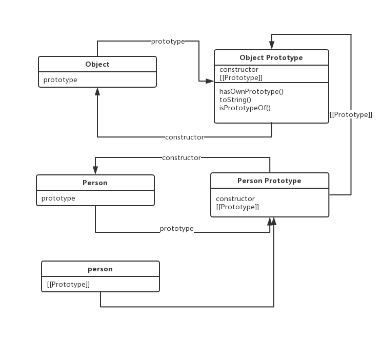
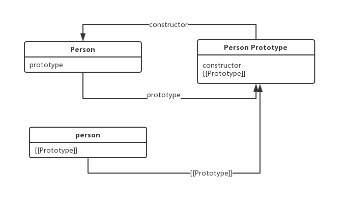

很多地方都看到”prototype属性是函数独有，__proto__是每个对象都有的属性“或者“__proto__和constructor是对象独有的”类似这样的说法，独有这个词很是让人烦恼。翻ECMAScript规范来验证一下这些说法，或者找到更合适的表达。 

## 关于prototype属性
> A prototype property is automatically created for every function defined using a FunctionDeclaration or FunctionExpression, to allow for the possibility that the function will be used as a constructor.——出自[规范](https://www.ecma-international.org/ecma-262/6.0/#sec-function-definitions-runtime-semantics-evaluation)  
**函数声明或者函数表达式创建函数时，就会自动为该函数创建一个prototype属性**，允许该函数作为构建函数
>
用代码和图示具体说明这个过程，ECMAScript规范——[函数声明](https://www.ecma-international.org/ecma-262/6.0/#sec-function-definitions-runtime-semantics-evaluation)   
  
```
function Person(){}
```
上面这行代码的运行过程：
- 函数声明首先生成Person函数；
- 以Object.prototype为原型生成Person的原型对象（Person Prototype）,并给该原型对象增加属性constructor属性，属性指向Person函数；（PS：Person的原型对象（Person Prototype）是调用Object.create函数生成，Person Prorotype中[[Prorotype]]指向它的原型Object.prototype）
- 给Person函数增加prototype属性，指向上一步生成的原型对象

## 原型和原型链
>Every object created by a constructor has an implicit reference (called the object’s prototype) to the value of its constructor’s "prototype" property. Furthermore, a prototype may have a non-null implicit reference to its prototype, and so on; this is called the prototype chain.——[出处](https://www.ecma-international.org/ecma-262/6.0/#sec-objects)
构造函数创建的每个对象都有一个对其构造函数“prototype”属性值的隐式引用(称为对象的原型)
>

JavaScript的每个对象拥有一个原型对象，对象以其原型为模板、从原型继承方法和属性。原型对象也可能拥有原型，并从中继承方法和属性，一层一层、以此类推。这种关系常被称为**原型链 。(prototype chain)**    
    
person是Person的实例，它的隐式引用（内部属性)指向它的原型Person Prototype。
Person Prototype的[[Prototype]]，指向它的构造函数Object的原型Object.prototype。
以此形成链
Object.prototype的原型是null（规范，没啥好说的），原型链的尽头是Object.prototype。

## __proto__和[[Prototype]]
>All ordinary objects have an internal slot called [[Prototype]]. The value of this internal slot is either null or an object and is used for implementing inheritance.
>
所有普通对象都有一个[[Prototype]]内部属性。这个值要么是null要么是一个对象。这个内部属性通常成为原型对象，作为内部属性本身不能够被访问，大多数浏览器实现了__proto__来访问这个内部属性。ES6中有了Object.getPrototypeOf(obj)来实现这个访问，__proto__已经被舍弃了。
```
function Person() {}
var person = new Person()
Person.prototype === Object.getPrototypeOf(person)  // true
```
## constructor
constructor：保存着创建当前对象的函数。
从上面的图可以看出，Object.prototype中有constructor属性，所以javascript的所有对象继承了该属性，如同hasOwnProperty()和toString()一样。
在上面的prototype有讲到它的值的产生。每个实例对象都从它的原型继承该属性。
```
function Person() {}
var person = new Person()
console.log(person.constructor) //[Function: Person]
```
## 参考
1、[ECMAScript规范——Object](https://www.ecma-international.org/ecma-262/6.0/#sec-objects)  
2、《JavaScript高级程序设计》   
3、[MDN——对象原型](https://developer.mozilla.org/zh-CN/docs/Learn/JavaScript/Objects/Object_prototypes)
