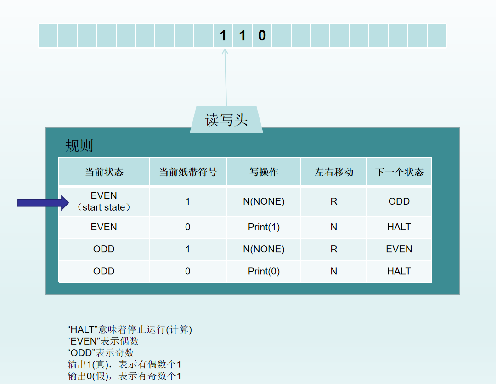
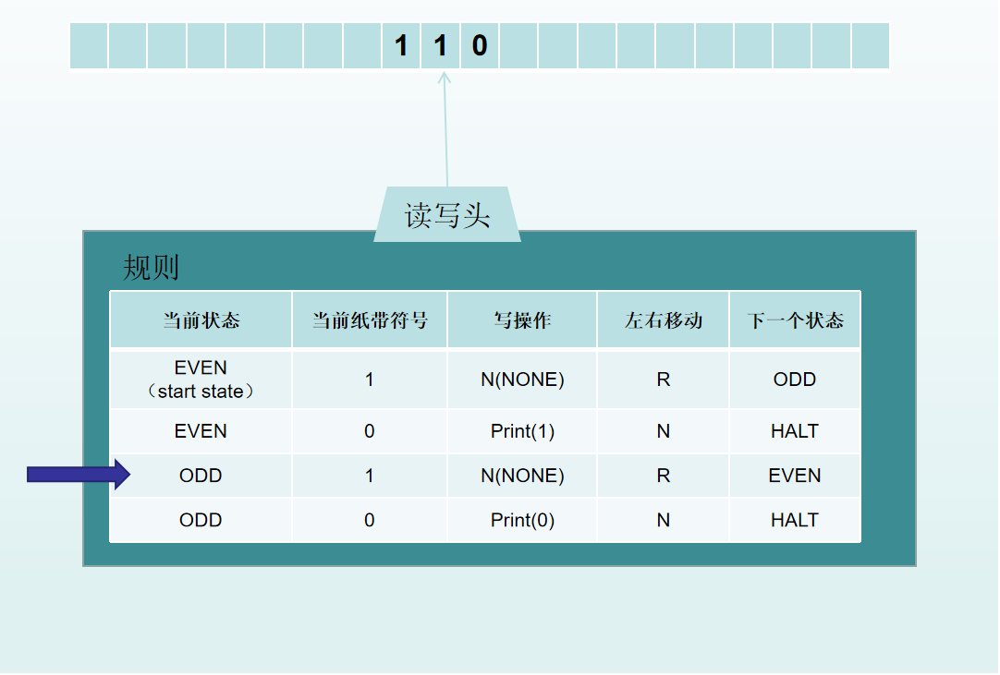
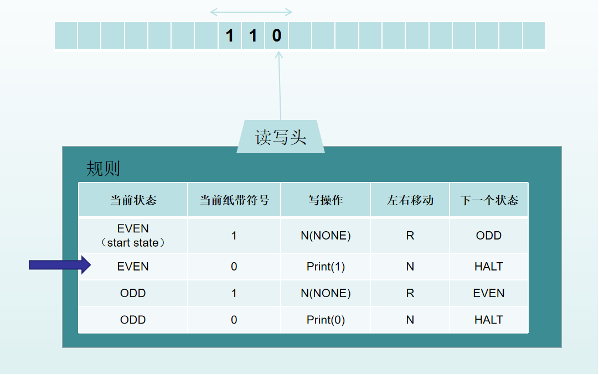

## 图灵的基本思想
图灵机将人们使用纸笔进行数学运算的过程进行抽象，由一个虚拟的机器替代人类进行数学运算。 
图灵证明只要有足够的时间和内存(纸带)，图灵机可以实现任何计算。最重要的意义是，图灵机模型证明了计算机实现的可能性。 
## 图灵机是什么？
- 图灵机是一个数学计算模型(mathematical model of computation)，是一个假想的机器。
- 图灵机的组成部分
    - 一条无限长的纸带，纸带被分为一个一个的格子，每个格子存储符号；
    - 读写头，可以读、写、修改纸带上的符号，每次移动一格；
    - 状态变量，保存当前状态；
    - 一组规则，描述机器可以做什么。根据当前状态和读写头扫描的符号，决定机器做什么。例如在纸带上写符号，修改状态，读纸带上的下一个符号等等； 

举例说明，让图灵机读一个由1组成并以零结尾的字符串，判断1出现的次数是不是偶数。运算步骤： 
1. 起始状态是"EVEN"，当前纸带的符号为1，根据规则表决定，向右移动一格，并且修改状态为"ODD"，下一步； 
 
2. 当前状态为"ODD"，当前纸带符号为1，根据规则表决定，向右移动一格，并修改状态为"EVEN"，下一步； 
 
3. 当前状态为"EVEN"，当前纸带符号为0，根据规则表，输出1(真),表示该字符串有偶数个1，停止 
 
 

## 停机问题
理发师悖论与停机问题是类似命题，更好理解。 

理发师悖论：小城的理发师，宣称他将为本城所有不给自己刮脸的人刮脸，并且只给这些人刮脸。那么如果他不给自己刮脸，他就属于“不给自己刮脸的人”，于是他就要给自己刮脸。但是他给自己刮脸，他又属于“给自己刮脸的人”，他就不能给自己刮脸。理发师悖论是罗素悖论的一个通俗说明。罗素悖论的出现，说明了存在无法计算的问题。 

停机问题用来判断一个程序是否能在有限的时间之内结束运行的问题。等价于如下判定：是否存在一个程序P，对于任意输入的程序w,能够判断w会在有限时间内结束或者死循环。图灵证明了不存在这样的程序。证明过程可以参考《离散数学及其应用》。

停机问题，罗素悖论等等问题的存在。证明了存在无法计算的问题。前面得出的结论是图灵机可以实现任何计算。两者共同的结论是，图灵机不能解决所有问题。

## 结论
图灵机模型证明了计算机实现的可能性，图灵机可以解决的问题的范围有限。

## 参考
- <https://en.wikipedia.org/wiki/Turing_machine>
- [理发师悖论](https://zh.wikipedia.org/wiki/%E7%90%86%E5%8F%91%E5%B8%88%E6%82%96%E8%AE%BA)
- 《离散数学及其应用》